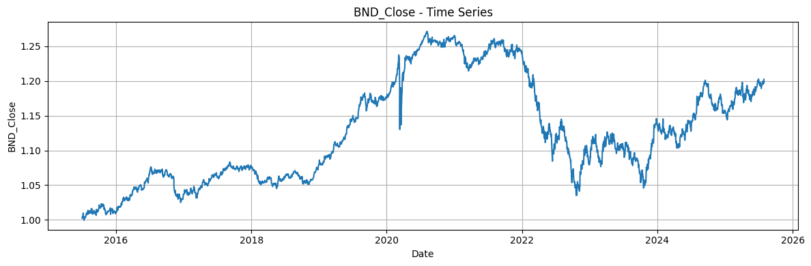
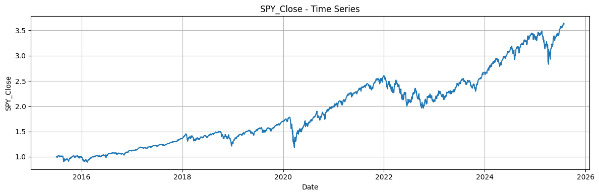
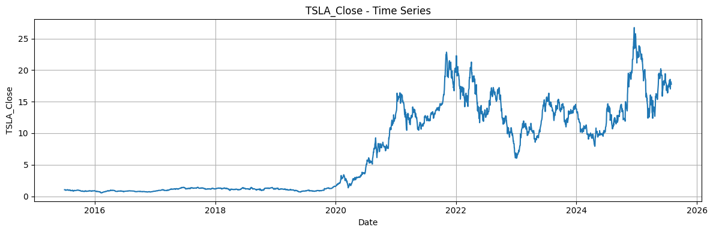

# Time Series Forecasting for Portfolio Management Optimization 

### The objective is to apply time series forecasting to historical financial data to enhance portfolio management strategies. 

# Task 1: Preprocess and Explore the Data

### Key Insights from Preprocessing and Exploration of the Dataset

✅ The dataset covers historical financial data for three assets—Vanguard Total Bond Market ETF (BND), S&P 500 ETF (SPY), and Tesla (TSLA)—from July 1, 2015, to July 30, 2025, sourced via YFinance. 

✅ The analysis includes data cleaning (handling multi-index structure, interpolation of missing values, type conversions), computation of daily returns, rolling statistics, outlier detection, stationarity tests (ADF), and risk metrics (VaR and Sharpe Ratio). 

✅ Below, I document the key insights as requested, focusing on TSLA while contextualizing it against BND (low-risk bond ETF) and SPY (moderate-risk market benchmark). 

✅ Insights are derived from the notebook's outputs, including descriptive statistics, visualizations (e.g., rolling mean/std plots), and computed metrics.

# Project Structure

<pre>
TSForecasting4Portfolio_Management_Optimization/
├── .github/workflows/ci.yml   # For CI/CD
├── data/                       # add this folder to .gitignore
│   ├── raw/                   # Raw data goes here 
│   └── processed/             # Processed data
├── notebooks/
│   └── README.md
|   └── preprocess-explore.ipynb   
├── src/
│   └── __init__.py
|   └── preprocess.py  
├── tests/
|   ├── __init__.py
|   ├── test_preprocess.py
│   └── test_add.py         # Unit tests
├── requirements.txt
├── .gitignore
├── LICENSE
└── README.md
</pre>

# Getting Started

Clone the repository

`git clone https://github.com/tegbiye/TSForecasting4Portfolio_Management_Optimization.git`

`cd TSForecasting4Portfolio_Management_Optimization`

Create environment using venv

`python -m venv .telenv`

Activate the environment

`.telenv\Scripts\activate` (Windows)

`source .telenv\bin\activate` (Linux / Mac)

Install Dependencies

`pip install -r requirements.txt`

📜 License This project is licensed un