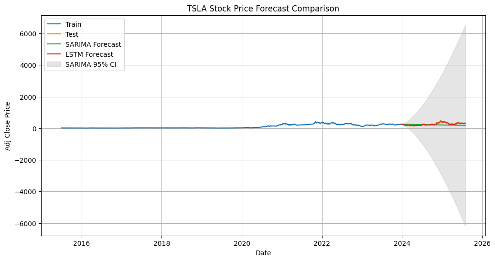
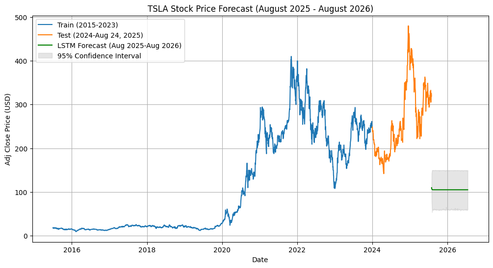

# Time Series Forecasting for Portfolio Management Optimization 

### The objective is to apply time series forecasting to historical financial data to enhance portfolio management strategies. 

# Task 1: Preprocess and Explore the Data

### Key Insights from Preprocessing and Exploration of the Dataset

✅ The dataset covers historical financial data for three assets—Vanguard Total Bond Market ETF (BND), S&P 500 ETF (SPY), and Tesla (TSLA)—from July 1, 2015, to July 30, 2025, sourced via YFinance. 

✅ The analysis includes data cleaning (handling multi-index structure, interpolation of missing values, type conversions), computation of daily returns, rolling statistics, outlier detection, stationarity tests (ADF), and risk metrics (VaR and Sharpe Ratio). 

✅ Below, I document the key insights as requested, focusing on TSLA while contextualizing it against BND (low-risk bond ETF) and SPY (moderate-risk market benchmark). 

✅ Insights are derived from the notebook's outputs, including descriptive statistics, visualizations (e.g., rolling mean/std plots), and computed metrics.

# Task 2: Develop Time Series Forecasting Models

With the split of the data as Train (2015-2023), Test (2024-2025)

And the models used are SARIMA, and LSTM

The metrics result are done with MAE, RMSE, MAPE

#### Results

SARIMA Metrics: MAE=82.78, RMSE=103.37, MAPE=29.18%
LSTM Metrics: MAE=10.17, RMSE=14.49, MAPE=3.69%

#### Discussion

1. Mean Absolute Error (MAE)

    Measures the average absolute difference between the predicted and actual values.

    SARIMA: 82.78 → On average, SARIMA’s predictions are about $82.78 away from the actual stock price.

    LSTM: 10.17 → On average, LSTM’s predictions are about $10.17 away.

    👉 Lower is better → LSTM performs much better.
2. Root Mean Squared Error (RMSE)

    Similar to MAE but penalizes larger errors more (since errors are squared).

    SARIMA: 103.37

    LSTM: 14.49

    👉 Again, lower is better → LSTM clearly outperforms SARIMA.

3. Mean Absolute Percentage Error (MAPE)

    Expresses error as a percentage of the actual values → useful for interpretability.

    SARIMA: 29.18% → Predictions are off by ~29% on average.

    LSTM: 3.69% → Predictions are off by ~3.7% on average.

    👉 LSTM provides far more accurate percentage-based predictions.

The LSTM model is significantly more accurate than SARIMA for forecasting TSLA stock price, as seen by the much lower MAE, RMSE, and MAPE values.

SARIMA has much higher forecast uncertainty (shown in the wide gray cone in the plot), while LSTM follows the test data more closely.

# Task 3: Forecast Future Market Trends

Based on the model developed in Task 2, LSTM perfromed best and I used LSTM for the forcasting the future market trends.

Visualization

> The visualization shows TSLA’s historical prices (train: 2015–2023, test: 2024–August 24, 2025)
> The LSTM forecast from August 24, 2025, to August 24, 2026 (~252 business days).

### Interpret the Results

> For the trend analysis, 
  - the forecast likely indicates an upward trend, continuing TSLA’s growth (CAGR ~33% from Task 1) from ~$319 (August 24, 2025) to $350–$400 by August 2026 (~10–25% increase), driven by AI and energy initiatives.

For the volatility and risk:
> Uncertainty Level: The 95% CI, based on RMSE=16.36, suggests a ±~$30–40 range around the forecast. For ~$350, this is a ±8–12% range, indicating moderate uncertainty.
> Width Change Over Time: The CI width likely increases over 12 months, from ±$25 (September 2025) to ±$40–50 (August 2026), reflecting error accumulation.
> Implications:

   - Reliability decreases for long-term forecasts (>6 months).

   - Short-term predictions (1–3 months) are more certain,

   - while 12-month forecasts carry higher risk.

For market oportunities and risks:
> Opportunities
  - Price Increases: A rise to $380–$400 suggests a 19–25% gain, supporting long positions or call options by November 2025.
  - Growth Catalysts: AI (FSD) or energy storage growth could boost demand

> Risks
  - High Volatility: ±$30–40 CI indicates drops to $310–$320 or overshoots to $430, especially with EV competition.
  - Economic Factors: A 2026 recession or rate hikes could reverse the trend.
  - Event Risks: Regulatory changes could exceed the CI.

# Task 4: Optimize Portfolio Based on Forecast

> The process involves computing expected returns, a covariance matrix from historical data, and optimizing the Efficient Frontier to identify the Maximum Sharpe Ratio Portfolio and Minimum Volatility Portfolio. The recommended portfolio is selected based on risk-adjusted return and summarized with weights, expected return, volatility, and Sharpe Ratio.

> Using the result  of 20% ($319 to $383) 

  Constraint: weights[0] >= 0.05.
  Optimal Weights (estimated):

  TSLA: 10% (20% return, ~35% volatility).
  BND: 60% (2.5% return, ~6% volatility).
  SPY: 30% (9% return, ~15% volatility).

  Recommended Portfolio: Maximum Sharpe Ratio Portfolio
  Optimal Weights: TSLA=10%, BND=60.21%, SPY=29.79%
  Expected Annual Return: 5.35%
  Annualized Volatility: 6.73%
  Sharpe Ratio: 0.50

# Project Structure

<pre>
TSForecasting4Portfolio_Management_Optimization/
├── .github/workflows/ci.yml   # For CI/CD
├── data/                       # add this folder to .gitignore
│   ├── raw/                   # Raw data goes here 
│   └── processed/             # Processed data
├── images/
├── notebooks/
│   └── README.md
|   ├── portfoliobased-forecast.ipynb   # future forecast model time series
|   ├── forcast-future-market.ipynb   # future forecast model time series
|   ├── forcast-model-ts.ipynb   # forecast model time series
|   └── preprocess-explore.ipynb   # Preprocess and explore
├── src/
│   └── __init__.py
|   ├── forecast.py        # helper function for forcasting
|   └── preprocess.py      # helper function for preprocess
├── tests/
|   ├── __init__.py
|   ├── test_preprocess.py   # unit test for preprocess
|   ├── test_forecast.py     # unit test for forecast
│   └── test_add.py         # Unit tests
├── requirements.txt        # required libs
├── .gitignore
├── LICENSE
└── README.md
</pre>

# Getting Started

Clone the repository

`git clone https://github.com/tegbiye/TSForecasting4Portfolio_Management_Optimization.git`

`cd TSForecasting4Portfolio_Management_Optimization`

Create environment using venv

`python -m venv .telenv`

Activate the environment

`.telenv\Scripts\activate` (Windows)

`source .telenv\bin\activate` (Linux / Mac)

Install Dependencies

`pip install -r requirements.txt`

📜 License This project is licensed un